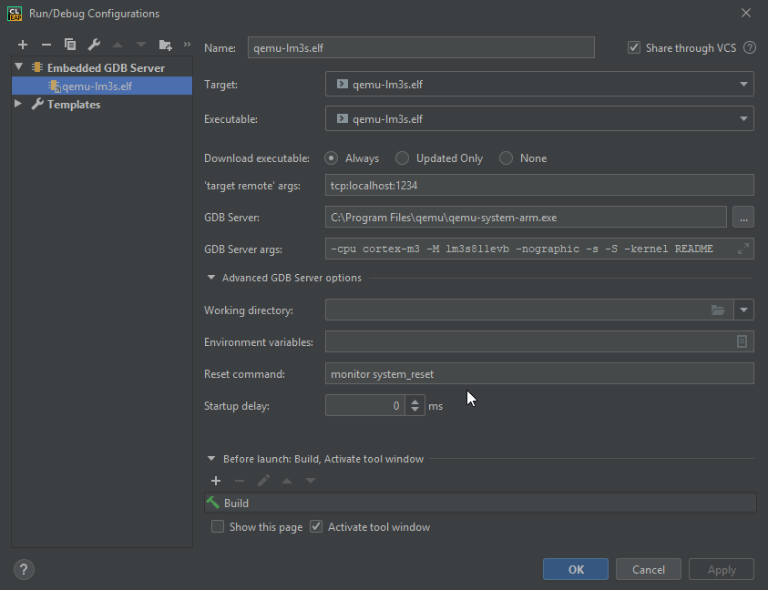

A small project to run QEMU in ARM Cortex-M3 mode with remote gdb endpoint.
=====

Primarily for testing CLion embedded support.

[CLion](https://jetbrains.com/clion/) 2019.2+ is required with embedded support plugin enabled.

Features
---
Uses QEMU emulation of TI lm3s811evb. QEMU is run with some garbage (README file) instead of kernel image. The binary is uploaded via gdb anyway but qemu
requires some kernel to start.

QEMU cmd arguments:
* `-cpu cortex-m3` - cpu type
* `-M lm3s811evb` - guest machine type
* `-nographic` - do not open window
* `-s` - cli shortcut to start gdbserver at port 1234
* `-S` - freeze execution, wait until gdb is connected
* `-kernel README` - load binary garbage as kernel

Standard CMSIS 5 for Cortex-M3 + libnano are used. CMSIS is modified according to lm3s memory map.

`stdout` is redirected to lm3s UART0.

There is a [fake peripheral device definition](fake_peripheral.svd) which may be used for debugging and testing
purposes. The "device" is located in RAM, at address `0x20001800`. In the program code it is filled up with values.

Clion Run configuration
---

